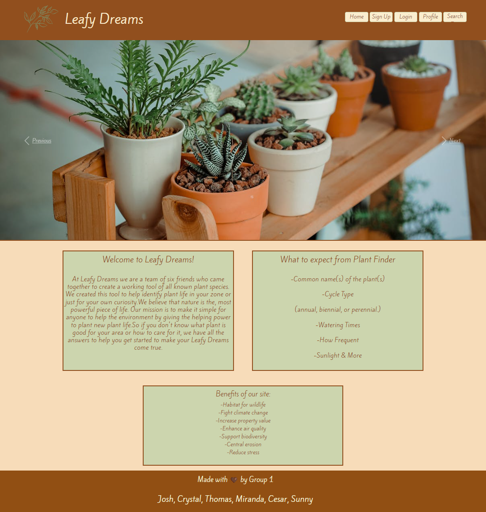
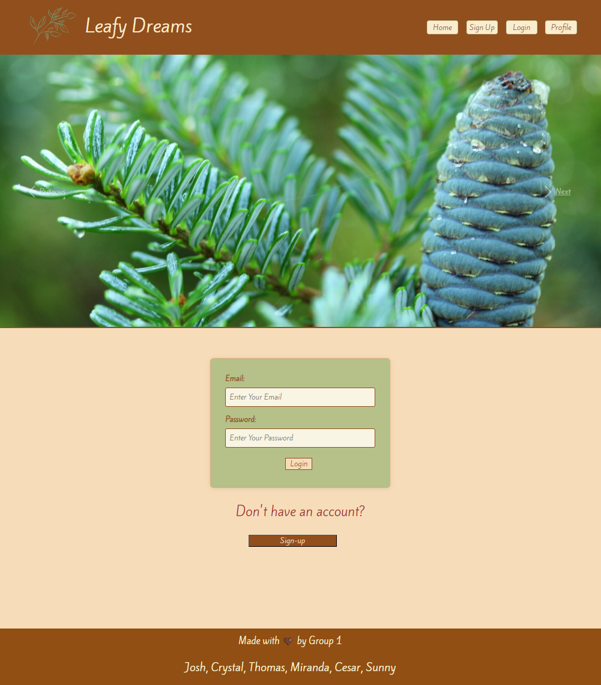
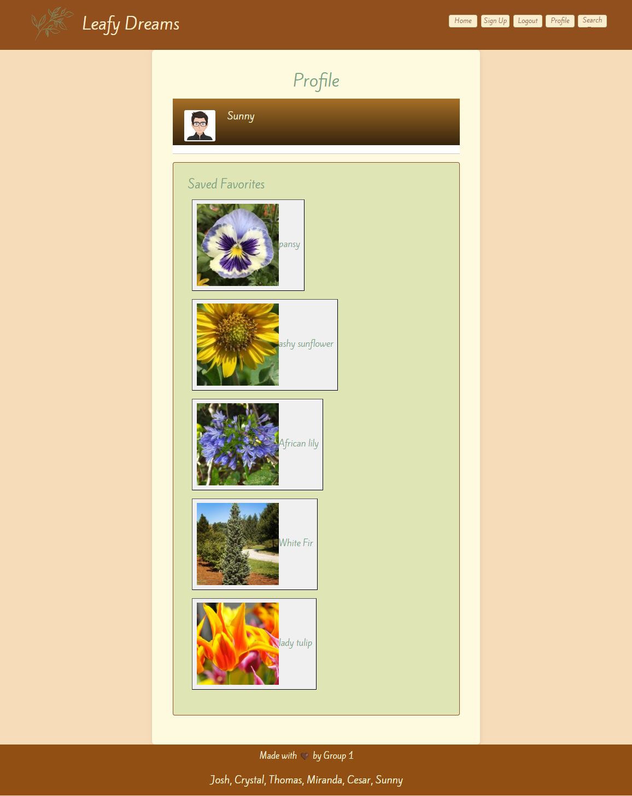
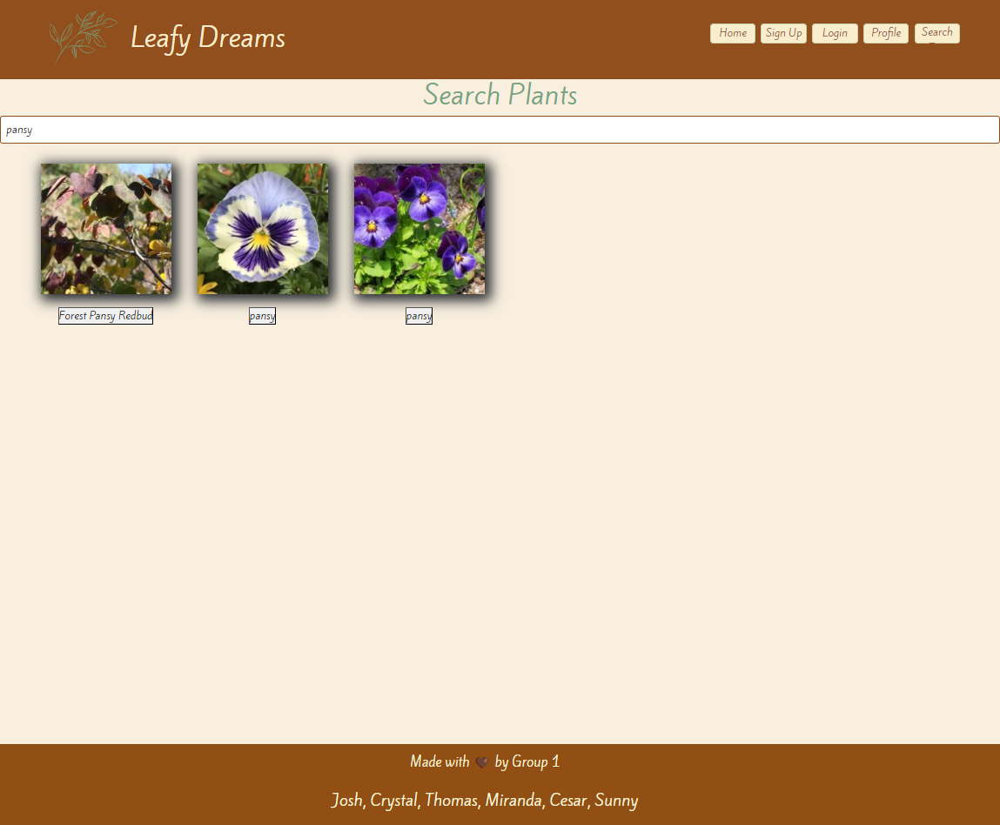

# Leafy Dreams

## Table of Contents

- [Description](#description) 
- [Links](#links) 
- [Visuals](#visuals) 
- [License](#license) 
- [Credits](#credits)
- [Questions](#questions) 

## Description

The task was to make a responsive and easy to use application to search for indoor and outdoor plants suitable for a particular climate zone. Within this search you will receive detailed care and maintenance information to help effectively grow and maintain the plants you want and keep them thriving for years to come.

## Links

- <a href="https://github.com/thomassmith0526/Leafy-Dreams">Github Repo Link</a> 
- <a href="https://leafy-dreams-zl5u.onrender.com/">Deployed Application Link</a>

## Visuals

 

## License

 
This application is covered under the MIT license

## Credits

- [Josh Stringer](https://github.com/Stringer-J) 
- [Crystal Lisi](https://github.com/smrsun) 
- [Thomas Smith](https://github.com/thomassmith0526) 
- [Miranda De La Paz](https://github.com/MommaDLP) 
- [Cesar Castro](https://github.com/cj4871) 
- [Sunny Finch](https://github.com/0-Sunny-0) 

## Questions

If you have any questions regarding this repo, please ooen an issue. 
You can also find more of our work separately by clicking on our respective names listed above!
